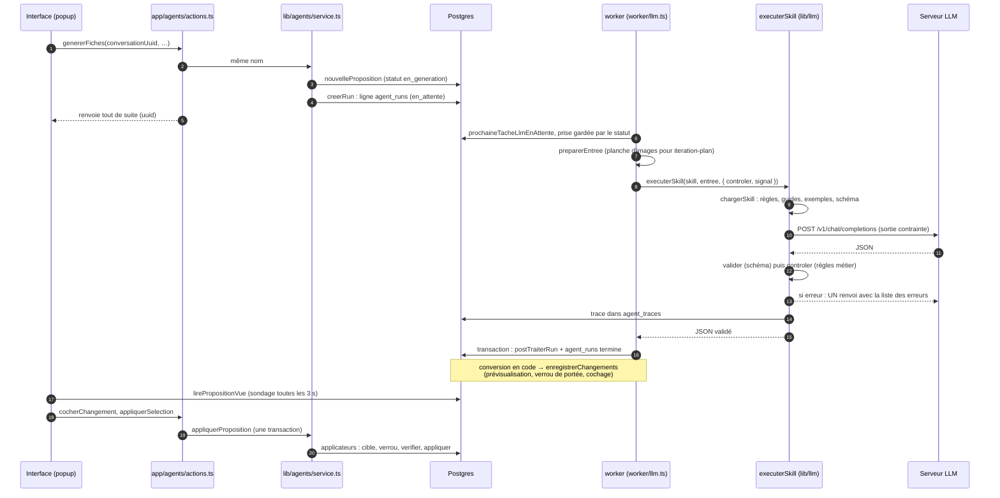

# Le cycle d'un skill : du bouton à l'écriture en base

**En une phrase** : un clic pose une tâche dans la file, le worker appelle le modèle, du code transforme sa réponse en changements, tu les relis, et seul « Appliquer » écrit dans le projet, en une seule transaction.

**À retenir**
- Le modèle ne touche jamais au projet : il rend un JSON ; c'est du code qui en tire des changements.
- Le JSON est validé contre un schéma. S'il est faux, le modèle est renvoyé **une fois** avec ses erreurs ; jamais de réparation silencieuse.
- Chaque appel laisse une trace complète en base (`agent_traces`) : c'est là qu'on regarde quand quelque chose échoue.
- L'application est **tout ou rien** : si un seul changement retenu est refusé, rien n'est écrit et le message dit lequel.
- Ce qui écrase quelque chose de déjà fait est décoché par défaut ; le cocher est ta décision.

## Le trajet complet

### 1. Le déclenchement
Le bouton ouvre la popup (`components/agents/BoutonAgent.tsx`). La popup appelle une action serveur de `app/agents/actions.ts`, qui n'est qu'une enveloppe de `lib/agents/service.ts` (puis invalide le cache des pages). Le service :
- vérifie qu'aucune tâche n'est déjà active sur la conversation (`tacheActive`, `lib/agents/runs.ts`) ;
- construit l'**entrée** du skill (les constructeurs vivent dans `lib/agents/contexte.ts`, par exemple `entreePlanH3`) et la liste « contexte utilisé » affichée dans la popup ;
- crée la proposition (`nouvelleProposition` : la précédente encore en attente est rejetée et ses tâches arrêtées) ;
- pose une ou plusieurs tâches avec `creerRun` (une ligne `agent_runs`, statut `en_attente`, champ `but` = `tour`, `brief` ou `proposition`).

L'action rend la main tout de suite. Fermer la popup n'interrompt rien.

### 2. La file et le worker
Le worker (`worker/index.ts`) choisit à chaque tour la prochaine tâche : images, puis appels au modèle, puis vidéos (voir [Worker et ComfyUI](worker-et-comfyui.md)). Pour un appel au modèle, `traiterTacheLlm` (`worker/llm.ts`) :
- vérifie que le serveur répond (`llmJoignable`, `worker/llamaSwap.ts`) ; sinon la tâche reste en attente, rien n'est consommé ;
- passe la tâche `en_cours` seulement si elle est encore `en_attente` (une annulation arrivée entre-temps gagne) ;
- surveille une demande d'annulation (`surveillerAnnulation`) et coupe alors la connexion ;
- prépare l'entrée (`preparerEntree`, `worker/agents/preparation.ts`) : l'entrée stockée telle quelle, sauf pour `iteration-plan` qui reconstruit la planche de vignettes du rendu ;
- appelle `executerSkill` avec le **contrôleur** du skill (`controleurPourSkill`, `lib/llm/controles.ts`).

### 3. L'exécution du skill (`lib/llm/executer.ts`)
1. `chargerSkill` (`lib/llm/skills.ts`) assemble le prompt système : `SKILL.md`, les `references/guide-*.md` (filtrés par variante), les `references/exemples/*.md`, les fichiers partagés, puis le schéma de sortie.
2. Le fournisseur (`lib/llm/compatibleOpenAI.ts`) envoie la requête, avec le schéma en contrainte (`response_format` json_schema) et, en flux, compte les jetons reçus (affichés dans le header).
3. `analyser` : sortie tronquée (`length`) ou JSON illisible = erreur ; sinon validation contre le schéma (`valider`, `lib/llm/validation.ts`).
4. Si le JSON est valide et qu'un contrôleur existe (`plan-h3`, `iteration-plan`), ses **erreurs** (pas ses alertes) déclenchent un renvoi.
5. Un seul renvoi par défaut (`maxRenvois`). Après, une sortie hors schéma lève `ErreurLlm("sortie_invalide")` ; une erreur de contrôle qui persiste laisse passer la sortie, et ses défauts apparaîtront dans la revue.
6. Dans tous les cas, une ligne `agent_traces` est écrite (images remplacées par un marqueur).

### 4. Le post-traitement (`worker/agents/postTraitement.ts`)
Dans **la même transaction** que le passage de la tâche à `termine` :
- `tour` : la réponse rejoint les messages de la conversation ; `briefPret` est mis à jour ;
- `brief` : un **brouillon** de brief est écrit (jamais par-dessus un brief validé) ;
- `proposition` : la sortie est convertie **en code** en changements (`lib/agents/conversion.ts`, `lib/agents/iteration-plan.ts`), puis `enregistrerChangements` (`lib/agents/proposition-db.ts`) les complète et les enregistre.

Si la conversion échoue, rien n'est écrit et la tâche passe `echoue` ; `surEchecRun` passe la proposition `echouee` (ou laisse le lot décider, `finaliserLot`).

### 5. L'enregistrement des changements
Pour chaque changement brut, `enregistrerChangements` :
- appelle `previsualiser` de l'applicateur de sa cible (lit l'état courant : `avant`, ce qui serait écrasé, avertissements, refus) ;
- résout la cible (`cible`) et applique le **verrou de portée** (`verifierPortee`, `lib/agents/portee.ts`) : hors portée = refusé d'office, avec la raison ;
- refuse un enfant dont le parent proposé est refusé ;
- calcule le **cochage par défaut** (`cocheParDefaut`, `lib/agents/cochage.ts`).
La proposition passe `prete` (un lot ne la passe `prete` que quand toutes ses sous-tâches sont closes).

### 6. La revue
La popup relit la proposition (`lirePropositionVue`, `app/agents/lecture.ts`) : groupes (écrasements en tête), avant/après, avertissements. Tu peux cocher (`cocherChangement`, `cocherChangements`), corriger une durée bloquée (`corrigerChangement`), rejeter, affiner (une nouvelle proposition avec ton retour) ou, dans un lot, relancer une sous-tâche (`relancerSousTache`).

### 7. L'application (`appliquerProposition`)
- Seuls les changements cochés, non refusés et non bloqués sont retenus, puis réordonnés pour qu'un parent créé passe avant ses enfants (`ordonnerParDependances`, `lib/agents/changements.ts`).
- Un écrasement retenu exige `confirmeEcrasement: true` (l'interface le pose : cocher est la décision).
- Dans **une** transaction, pour chaque changement : parent retenu ?, applicateur présent ?, `cible`, verrou de portée, `verifier`, `appliquer`. Le premier refus annule tout.
- Si un personnage ou une voix est créé, `rattacherRepliquesLibres` relie les répliques qui l'attendaient.
- Statut final : `appliquee` (tout appliqué) ou `partielle` (certains écartés, bloqués ou refusés).

## Fiche technique

**Fichiers clés** : `app/agents/actions.ts`, `lib/agents/service.ts`, `lib/agents/runs.ts`, `lib/agents/contexte.ts`, `worker/llm.ts`, `worker/agents/preparation.ts`, `lib/llm/executer.ts`, `lib/llm/skills.ts`, `lib/llm/controles.ts`, `worker/agents/postTraitement.ts`, `lib/agents/conversion.ts`, `lib/agents/proposition-db.ts`, `lib/agents/applicateurs/index.ts`, `lib/agents/cochage.ts`, `lib/agents/portee.ts`, `lib/agents/lots.ts`.

**Fonctions à connaître** : `creerRun`, `traiterTacheLlm`, `preparerEntree`, `executerSkill`, `controleurPourSkill`, `postTraiterRun`, `surEchecRun`, `enregistrerChangements`, `appliquerProposition`, `finaliserLot`.

**Tables** : `agent_conversations`, `propositions`, `proposition_changements`, `agent_runs`, `agent_traces`, `briefs` (voir [Les données](donnees.md)).

**Statuts**
- `agent_runs.statut` : `en_attente`, `en_cours`, `termine`, `echoue`, `annulee`.
- `propositions.statut` : `en_generation`, `prete`, `appliquee`, `partielle`, `rejetee`, `echouee`.
- `agent_traces.statut` : `ok`, `invalide`, `echoue`, `interrompu`.

**Invariants à ne pas casser**
- Une action serveur renvoie `{ ok: true, … } | { ok: false, erreur }`, jamais d'exception pour un cas métier.
- Le post-traitement s'exécute dans la transaction qui marque la tâche terminée ; il doit être **idempotent** pour une sous-tâche de lot (il remplace ses propres lignes, `sousTache`).
- La vérification de portée a lieu deux fois : à l'enregistrement ET à l'application (l'état a pu changer).
- Une tâche n'est jamais rejouée automatiquement : un échec se relance à la main.
- Le JSON n'est jamais réparé en silence.

**Pièges connus**
- Une tâche d'essai posée par `scripts/agents-e2e.ts` porte `options.suspendu = true` : le worker ne la prend jamais.
- Un redémarrage du worker (chaque sauvegarde avec `npm run worker`, qui est un `tsx watch`) fait échouer l'appel en cours (« Interrompue (worker redémarré) », `worker/reprise.ts`).
- Une proposition rejetée pendant sa génération ne reçoit pas les changements (le post-traitement ne fait rien si le statut n'est plus `en_generation`).

**Tester** : `npm test` (règles pures : `lib/agents/agents.test.ts`, `lib/llm/llm.test.ts`) et `npm run agents:e2e` (chaîne complète avec le vrai worker et un faux modèle, base de dev).

**Dernière vérification** : 2026-10-02 (commit 1e88970, plus les modifications non commitées de la branche `feature/agents-skills`).

**Voir aussi** : [Les skills](skills.md) · [Cibles et applicateurs](cibles-et-applicateurs.md) · [Le LLM](llm.md) · [Déboguer une tâche d'agent](recettes/deboguer-une-tache-agent.md)
