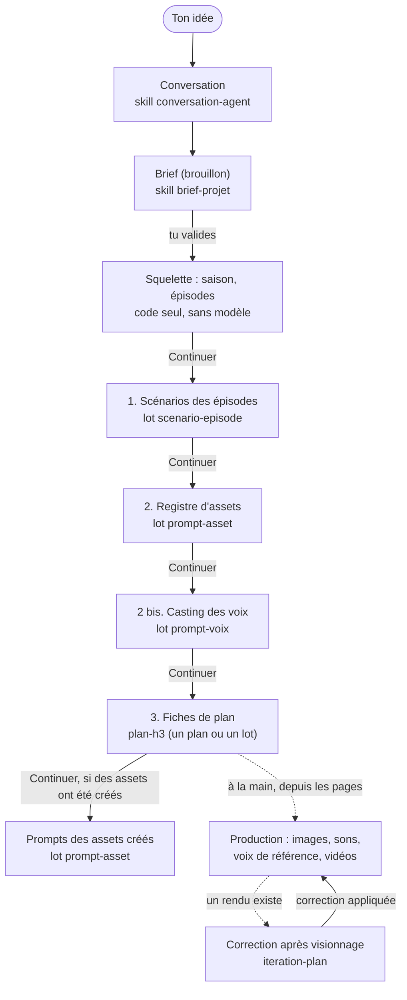

# Vue d'ensemble : de l'idée à la vidéo

**En une phrase** : tu décris une idée, des agents (des appels à un modèle de langage local) en tirent un brief, des épisodes, des plans, des assets, des voix et des fiches de plan ; tu relis et valides chaque étape, puis la production (images, sons, vidéos) se lance à la main depuis l'application.

**À retenir**
- Chaque étape produit une **proposition** : une liste de changements que tu relis et coches. Rien n'est écrit dans le projet avant que tu cliques « Appliquer ».
- Les étapes s'enchaînent par un bouton « Continuer : … » ; rien ne s'enchaîne tout seul.
- Tous les appels au modèle passent par une **file d'attente** unique, partagée avec ComfyUI (une seule carte graphique).
- Les étapes 1 à 3 (scénarios, registre, voix, fiches de plan) et la correction après visionnage sont branchées. La production n'est pas enchaînée : elle se lance depuis les pages (assets, casting, plans).
- Écartés pour l'instant : une page de suivi des propositions (« Monitoring ») et un « point de retour » (annuler une proposition appliquée).

## Le pipeline, dans l'ordre

Chaque flèche pleine entre deux étapes passe par une **revue** : tu relis les changements, tu coches, tu appliques.

| Étape | Qui travaille | Ce qui est écrit | État |
|---|---|---|---|
| Conversation | modèle, un tour par message | messages de la conversation | branché |
| Brief | modèle (`brief-projet`) | un brouillon de brief, puis validé à l'application | branché |
| Squelette | code seul | saison, épisodes, brief (avec la clause de style) | branché |
| 1. Scénarios | modèle, un appel par épisode (lot) | scènes, plans (durée 5 à 15 s), répliques liées aux plans | branché |
| 2. Registre d'assets | modèle, un appel par personnage ou lieu du brief (lot) | assets `CHAR_…`, `DEC_…` et leur prompt d'image | branché |
| 2 bis. Casting des voix | modèle, un appel par voix manquante (lot) | asset `VOICE_…` et sa fiche de casting | branché |
| 3. Fiches de plan | modèle, un appel par plan (seul ou en lot) | six sections du prompt H3, références, durée ; assets manquants créés | branché, pas encore essayé avec le vrai modèle dans l'interface (FRICTIONS) |
| Prompts des assets créés | modèle, un appel par asset (lot) | prompt d'image des assets créés par les fiches | branché |
| Correction après visionnage | modèle qui voit (images du rendu) | quelques passages des sections du prompt | branché, pas encore essayé avec un vrai rendu (FRICTIONS) |
| Production | worker + ComfyUI | candidats d'images, de sons, de voix de référence ; rendus vidéo | branché à la main, **non enchaîné** au pipeline |

**Ce qui n'est pas branché** : les prises de répliques (CosyVoice3, voir `workflows/README.md`) ; l'enchaînement automatique des étapes ; la suppression par une proposition (refus explicite) ; le fournisseur Claude (seul le modèle local existe).

**Écarté (décision de l'utilisateur, 2026-10-02)** : la page de suivi des propositions (Monitoring) et le point de retour. La fonction `listerPropositions` (`lib/queries-agents.ts`) existe mais aucune page ne l'affiche.

## Fiche technique

**Fichiers clés**
- Points d'entrée de l'interface : `components/agents/BoutonAgent.tsx` (ouvre la popup), `components/agents/AgentDialogue.tsx` (la popup à étapes), `components/agents/EtapeApplique.tsx` (les boutons « Continuer : … »).
- Sélecteurs de lot : `components/agents/ChoixEpisodes.tsx`, `components/agents/ChoixAssets.tsx`, `components/agents/ChoixVoix.tsx`, `components/agents/ChoixPlans.tsx`, `components/agents/ChoixIteration.tsx`, `components/agents/SuitePromptsAssets.tsx`.
- Actions serveur (enveloppes) : `app/agents/actions.ts` ; lectures : `app/agents/lecture.ts`, `lib/queries-agents.ts`.
- Toute la logique : `lib/agents/service.ts` (`envoyerMessage`, `genererBrief`, `genererProposition`, `genererScenarios`, `genererRegistre`, `genererVoix`, `genererFiches`, `genererPromptsAssetsCrees`, `genererIteration`, `appliquerSelection`).
- Squelette en code : `lib/agents/squelette.ts` (`squeletteDepuisBrief`).

**Où sont les boutons** (vérifié dans le code)
- Nouveau projet : la page `/nouveau` (`components/conception/ConceptionAssistant.tsx`, cinq choix : format, genre et ton, durée, langue, style), puis `/p/<id>/demarrage` (`components/conception/DemarrageAssistant.tsx`) : l'entretien avec le scénariste, le clap, et le lancement de la préparation. L'ancienne modale `NouveauProjetModal` a disparu.
- « Écrire les scénarios » : `components/projects/SaisonSection.tsx`.
- « Créer le registre depuis le brief » : `app/p/[projectId]/assets/page.tsx`.
- « Créer les voix manquantes » : `app/p/[projectId]/voix/page.tsx`.
- « Écrire les fiches de plan » : `components/projects/EpisodeInfoPanel.tsx`.
- « Écrire la fiche » / « Réécrire la fiche » / « Corriger après visionnage » : `app/p/[projectId]/e/[episodeId]/plans/[uuid]/page.tsx`.

**Invariants à ne pas casser**
- Aucune écriture dans les tables du projet hors de `appliquerProposition` (`lib/agents/proposition-db.ts`), sauf les brouillons de brief et les messages de conversation.
- Validation manuelle à chaque étape : pas d'enchaînement automatique (FRICTIONS, « Écrire les scénarios des épisodes »).
- « L'histoire d'abord » : le scénario ne déclare aucun asset ; les masters viennent du brief, les accessoires et effets des fiches de plan.
- Ordre du pipeline : brief → squelette → scénarios → registre → voix → fiches de plan.

**Pièges connus**
- Un skill ne voit que ce qui a déjà été **appliqué** : lancer les fiches avant d'avoir appliqué le registre donne des fiches sans références.
- Des répliques écrites avant que leur personnage existe gardent un locuteur texte ; elles sont rattachées quand une proposition crée ce personnage ou sa voix (`lib/agents/rattachement.ts`).

**Tester** : `npm run agents:e2e` parcourt tout le pipeline avec un faux modèle sur la base de dev (voir [Lancer les tests](recettes/lancer-les-tests.md)).

**Dernière vérification** : 2026-10-02 (commit 1e88970, plus les modifications non commitées de la branche `feature/agents-skills`).

**Voir aussi** : [Le cycle d'un skill](cycle-d-un-skill.md) · [Les skills](skills.md) · [Worker et ComfyUI](worker-et-comfyui.md) · [Décisions](decisions.md)
